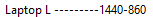
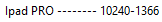
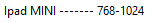
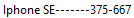
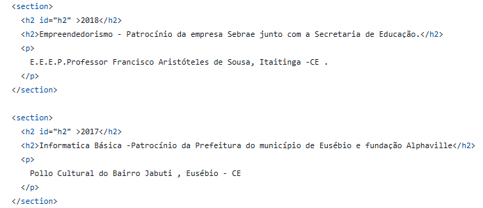
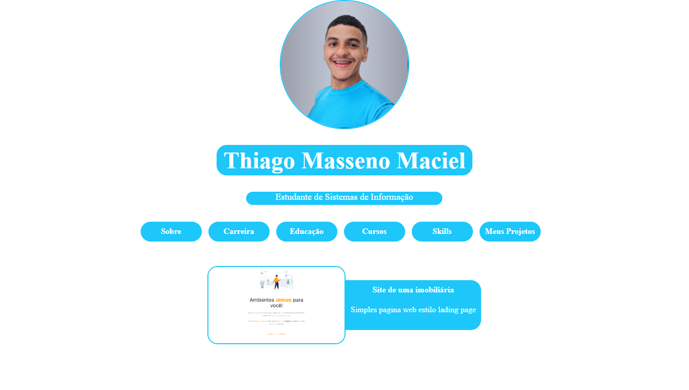
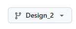

###### MYportifolio.github.io


# Meu Portifólio Version 2.0
#### veja o portifólio clicando [aqui](https://m-yportifolio-github-io.vercel.app/)

###### a branch desta versão é


# Version 2.0 Teacnologias
###### Html5
###### Css3
###### Javascript
###### React + Vite

## Layouts

<video controls src="Laptop L ---------1440-860.mp4" title="Title"></video>

<video controls src="Ipad PRO -------- 10240-1366.mp4" title="Title"></video>

<video controls src="Ipad MINI ------- 768-1024.mp4" title="Title"></video>

<video controls src="Iphone SE-------375-667.mp4" title="Title"></video>

## O que eu Aprendi ?
###### Para usar o fit-content dentro da width e height precisa ter o box-sizing : content-box
###### Arquivo `App2.jsx` - testei o meu jeito de fazer um spa ignorando as rotas usando classe componente react
###### Arquivo `App3.jsx` (App3 - explicação da foto {VIDEO})- para cada li dispara uma função diferente de acordo com a flag que vai ser mudada

###### Arquivo `App.jsx` - spa ignorando rotas e usando classe componente do jeito que eu inventei

###### Antes de começar a programar definir os requisitos do jeito que eu quero que apareça ou não apareça na tela depois que o usuário clicar e ou quais reações na tela vai acontecer depois do click

###### Se uma div não tem `display:flex` , seus filho ocuparão toda width disponível, mesmo com o seu tamanho definido.
###### Se uma div tem o `display:flex` , seus filhos ocuparão o seu tamanho definido.

###### Selecionar a maioria dos elementos nemos aquele com atributo específico
```
section h2:not(#h2){
  color: var(--cor-constraste-1);
  background-color: var(--cor-padrao);

  border-radius: 2rem;

  padding: 1rem;
}
```
###### este seleciona todos os h2 dentro da div section menos aquele h2 com o id `h2`

##### para ter este resultado

# React + Vite


# Version 1.0

###### a branch desta versão é

###### fiz deploy deste no `Fleek` [link](https://tmm.on-fleek.app/) n tem tls
###### farei deploy no vercel app [aqui](https://portifolio-iota-two-78.vercel.app/)
###### Veja meu projeto hospedado no github.io [link](https://thiagomassenomaciel.github.io/MYportifolio.github.io/)
###### Para ver o figma deste projeto [link](https://www.figma.com/file/HOBma4n9TRH3bXMHDic5if/MY-PORTIFOLIO-(Community)?type=design&node-id=0%3A1&mode=design&t=RQnZIso5WOC2BlWW-1)


# Version 1.0 Teacnologias
###### Html5
###### Css3 + bootstrap icons
###### Javascript

###### O jeito que ajeitei as screens SMARTPHONES foi colocar o minimo de tela no dev tools  320 e terminei até todos html com limite de pixel 320px aparecerem normal na viewport que estou concertando e com rem 
    reconsiderei todas as telas menores que 425px    ----> limite máximo da tela smartphone 
